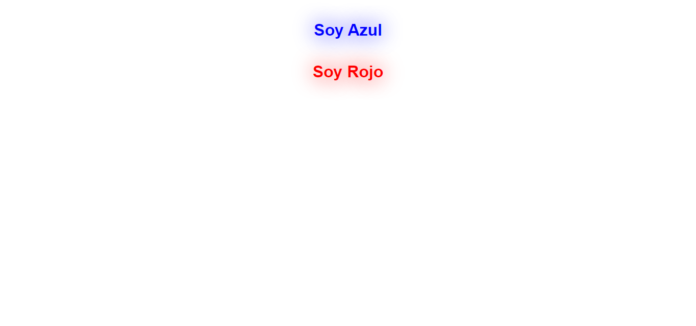

<h1>Taller 9 - Andres Mauricio Gonzalez Acosta</h1>

<h2>Informacion</h2>

Curso: Full Stack Basico - Grupo 1

Profesor: Cristian Patiño

<h2>Link de la pagina web</h2>

<h2>Punto 1: Link de Figma</h2>
<a href="https://www.figma.com/file/1Gak1OS08vup6pmGtZYgxI/Andr%C3%A9s-Mauricio-Gonzalez-Acosta?type=design&node-id=5%3A256&mode=design&t=oHvtbb3oJahsBgJo-1">Link de Figma</a>

<h2>Punto 2: Diseño en HTML</h2>

<h2>Punto 3: Diseño en CSS</h2>

<h2>Punto 4: Títulos</h2>

<h2>Punto 5: Parrafo</h2>

<h2>Punto 6: Links</h2>

<h2>Punto 7 y 8: Navegacion</h2>

<h2>Punto 9: Tabla</h2>